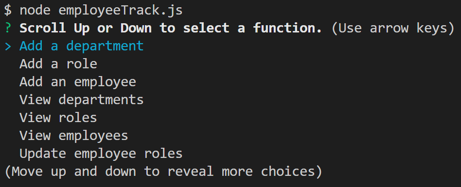

# 12-employee_tracker
___
## Objective
Create an application that manages a company's employees using node, inquirer, and MySql.
___
## Table of Contents
* [Description](#description)
* [Layout](#layout)
* [Installation](#installation)
* [Usage](#usage)
* [License](#license)
* [Contributing](#contributing)
* [Questions](#questions)
* [Application_Links_and_Images](#application_links_and_images)
## Description:
 This is a command-line app that generates a CMS, Content Management System, allowing users to track company employees by adding or viewing departments, roles, and employees.  The user can also update employee roles.
_____
## Layout:
A **employee_db** database and associated tables were created per instructions as shown in the **schema.sql** file.  The information was copied/pasted to a New Query Tab inside MySql Workbench.   
Data as shown in the **seeds.sql** file was inserted into the tables, and the tables were created in Workbench.
Once the app is installed and invoked (per installation), the user is prompted to select a function from the following selection:
- **Add a department**, and the user is prompted to add the name of the new department
- **Add a role**, and the user is directed to another series of prompts related to adding a new employee role/position
- **Add an employee**, and the user is directed to another series of prompts related to adding a new employee
- **View departments**, and the table data for the company departments is displayed on the console  
- **View roles**, and the table data for the company roles is displayed on the console    
- **View employees**, and the table data for the company employees is displayed on the console
- **View employee roles**, and the user is directed to another series of prompts related to updating an employee's role/position
- **Exit**, to exit the app and return to the terminal prompt $
___
## Installation
(1) Type **npm i** (install) to install all required dependencies for the app   
(2) Add user password between quotes (" ") in employeeTrack.js file.   
(3) Invoke the app by going to the employeeTrack.js file, open in integrated terminal, and type:    
 **node employeeTrack .js**   
(4) Answer the prompts related to the user selected layout functions described above   
_____
## Usage
This App allows the user to manage and update their company's departments, employees, and roles for each employee. 
_____
## Contributing
ed-sivick, Stack Overflow, Grepper, BCS support for functionality and code syntax
_____
## Questions
If there are any questions, or if you would prefer more information concerning this app,
please contact the following person at their GitHub profile or email address below:

* [GitHub Profile](https://github.com/ed-sivick)
* ed@sivick.net
_____
## License
You can view more information concerning software licenses at the following link:

* [License](https://opensource.org/licenses/MIT)
_____
## Badges

___
## Application_Links_and_Images  
**Links:**  
App video functionality link: (https://drive.google.com/file/d/1T61ChJv5hAEPwd0DRS5CiCegvXaTIYLg/view?usp=sharing)   

**Application Image Examples:** Hover the mouse over each image for a brief description.

  
  
  
  

  

  
  
  
  

   

  
  
  
  

